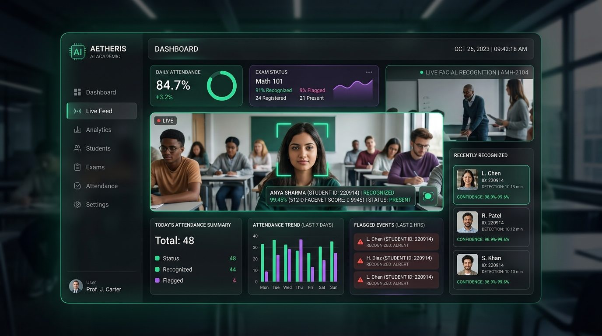
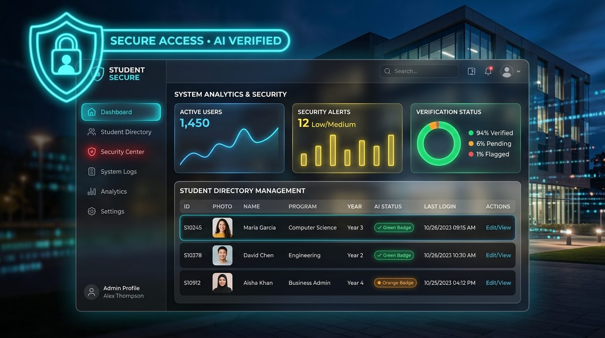

# Django AI Face Recognition Attendance System (PyTorch + FaceNet VGGFace2)

<p align="center">
  
</p>

## 📌 Project Overview

An advanced, premium web-based **AI Face Recognition Attendance System** built using **Django**, **PyTorch (InceptionResnetV1/FaceNet)**, and **OpenCV (LBPH Fallback)**. 

This system provides a full web interface for faculty authentication, student record directory management, real-time webcam face check-ins, automated Excel reporting, and a custom glassmorphic administration panel. It features a thread-safe, asynchronous background face encoding pipeline with a live step-by-step progress modal in the frontend.

---

## 💎 Features & Customizations

### 🖥️ 1. Modern Glassmorphic Dashboard
- **Analytics Cards**: Interactive indicators for average attendance rates, total sessions, handling subjects, and checked-in counts.
- **Faculty Profiles**: Protected views dynamically displaying profile data (Full Name, Department, Email) via Django Session Authentication.

### 👥 2. Student Directory & CRUD Panel
- **Profile Management**: Register new students, upload face photos, edit details, and delete profiles.
- **Asynchronous Deep Learning Encoding**: Profile saving triggers a background thread that extracts 512-D FaceNet face vectors and retrains the LBPH face classifier.
- **Step-by-Step Progress Wizard**: A full-screen overlay modal in the frontend displays a circular progress percentage ring and a checklist showing completion indicators for each background phase in real time:
  1. *Database Record Setup* (15%)
  2. *Photo File Analysis* (30%)
  3. *FaceNet Embedding Calculation* (60%)
  4. *LBPH Local Model Training* (85%)
  5. *Profile Active* (100% / Success)
  - If no face is detected, it transitions to a **Failed state** showing the warning details and options to choose another file.

### 🎥 3. Real-Time Webcam Scanner
- **MJPEG Streaming**: Serves annotated webcam frames directly to browser templates.
- **Dual Verification Engine**: Cosine distance mapping (< 0.4) on 512-D FaceNet vectors, falling back to local LBPH class predictions.
- **Multi-Frame Voting (4/5)**: Eliminates false positives by verifying face match consistency across consecutive frames before check-in.
- **Cooldown Lock**: A 60-second database check-in lock prevents duplicated logs.

### 🔒 4. Redesigned Site Administration & Student Security
- **Glassmorphic Overrides**: Transparent `.module` frames with `backdrop-filter: blur(10px)` and glowing borders matching the parent theme.
- **App Caption Gradients**: Deep dark purple-to-blue gradient app headings replacing the default flat admin headers.
- **Pill Buttons**: Glassmorphic action pill elements for `+ Add` and `Change` links.
- **Dynamic Icons**: JavaScript scans model rows to inject appropriate FontAwesome icons (`Students` -> graduate, `Attendance logs` -> clock, etc.).
- **Timeline Feed**: Modern Activity log list styling.
- **In-List Status Polling**: Admin changelist columns feature live progress bars and step labels showing face status processing.

<p align="center">
  
</p>

---

## ⚙️ Technologies Used

* **Web Framework**: Django 5.0.6
* **Deep Learning Engine**: PyTorch, `facenet-pytorch` (InceptionResnetV1 pre-trained on VGGFace2)
* **Computer Vision**: OpenCV (`opencv-contrib-python` for Haar Cascades & LBPH face classifiers)
* **Data Processing**: Pandas, OpenPyXL (Excel export engine)
* **Database**: SQLite (SQL query serialization with connection closures)
* **Design Engine**: HSL Vanilla CSS, FontAwesome 6, SVG circular progress rings

---

## 📂 Project Directory Structure

```text
django-face-attendance/
├── assets/                     # UI previews and banner graphics
│   ├── hero_banner.jpg         # Dashboard & AI scanning preview
│   └── admin_portal_preview.jpg # Administration & student directory preview
├── run_server.bat              # One-click Windows development server launcher
├── update_data.bat             # One-click migrations & AI recompute script
├── manage.py
├── requirements.txt
├── README.md
├── db.sqlite3
├── README.md
├── db.sqlite3
├── Models/                     # Deep learning models directory
│   ├── facenet_model/          # FaceNet weights
│   └── lbph_model/             # Trained LBPH .yml classifiers
├── media/
│   └── students/               # Profile face photos uploads
├── face_attendance_project/    # App settings & routing
└── attendance/                 # Core Attendance module
    ├── admin.py                # Admin customization helpers
    ├── models.py               # Student background thread save hooks
    ├── views.py                # Video feeds, AJAX pollers, & auth views
    ├── urls.py                 # View routing
    ├── templates/              # HTML layout templates
    │   ├── admin/
    │   │   └── base_site.html  # Custom admin overrides stylesheet/js
    │   └── attendance/         # Main frontend templates
    │       ├── base.html
    │       ├── dashboard.html
    │       ├── login.html
    │       ├── register.html
    │       └── manage_students.html
    └── static/
        └── attendance/
            └── style.css       # Core stylesheet definitions
```

---

## 🚀 Setup & Execution Guide

### ⚡ Quick Start (Windows One-Click)
- **Start Web Application**: Double-click [`run_server.bat`](file:///c:/Users/Dhanin/.gemini/antigravity/scratch/django-face-attendance/run_server.bat). It automatically checks the virtual environment, verifies migrations, launches Django at `http://127.0.0.1:8000/`, and opens your default browser.
- **Update Data & Recompute Models**: Double-click [`update_data.bat`](file:///c:/Users/Dhanin/.gemini/antigravity/scratch/django-face-attendance/update_data.bat). It runs all new migrations and recalculates 512-D FaceNet embeddings + retrains the LBPH model.

---

### Manual Terminal Instructions

#### 1. Activate Environment & Apply Migrations
```powershell
.venv\Scripts\python manage.py makemigrations
.venv\Scripts\python manage.py migrate
```

#### 2. Create Faculty / Admin Account (Optional)
If you need a new faculty superuser account:
```powershell
.venv\Scripts\python manage.py createsuperuser
```
(Or change an existing user's password: `.venv\Scripts\python manage.py changepassword dhanin`)

#### 3. Update / Recompute Face AI Data
If you added or modified student photos or want to force-recalculate all 512-D FaceNet embeddings:
```powershell
.venv\Scripts\python recompute_encodings.py
```

#### 4. Run Development Server
```powershell
.venv\Scripts\python manage.py runserver 127.0.0.1:8000
```
Then open:
* **Main Dashboard**: `http://127.0.0.1:8000/`
* **Django Admin**: `http://127.0.0.1:8000/admin/`

---

## 📝 Updating Data

### A. Updating Data via the Web Interface (UI)
1. Log in to `http://127.0.0.1:8000/`.
2. Go to **Student Directory** (`/students/`).
3. Click the **Edit (pencil)** button next to any student row.
4. Update the student's **Name**, **Roll Number**, **Department**, **Section**, **Parent Email**, **Phone**, or upload a new **Face Photo**.
5. Click **Update Student**. The system automatically triggers the asynchronous background pipeline to compute new 512-D FaceNet embeddings and retrains the LBPH classifier!

### B. Updating Data Programmatically (Django Shell / Python)
You can also update records directly with Python:
```python
from attendance.models import Student

# Find student
student = Student.objects.get(roll_number="1")
student.name = "DHANIN T"
student.parent_email = "parent@example.com"
student.save() # Saves data and recomputes encodings if photo is changed
```

